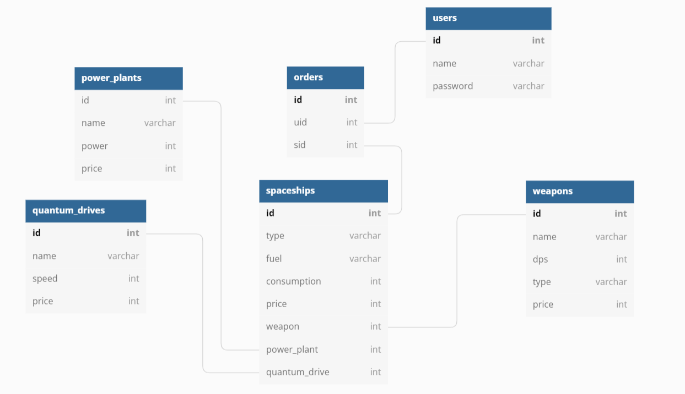
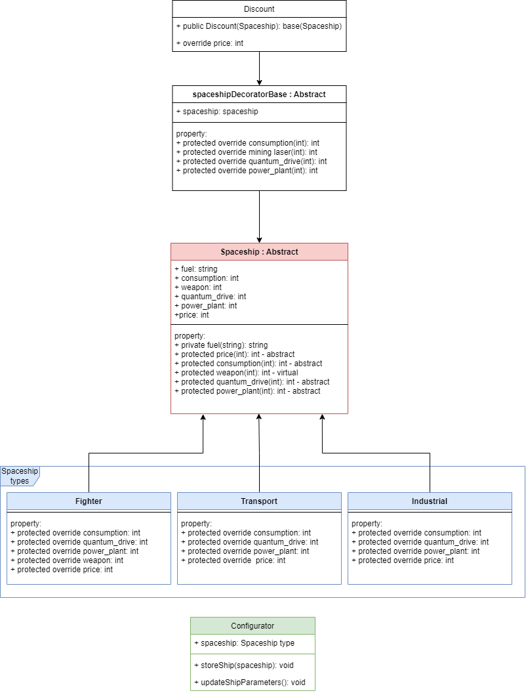

## 1. Rendszer célja
A rendszer célja egy ablakos alkalmazás, amivel különböző űrhajókat tudunk összerakni, majd megrendelni. Az alkalmazás használatához szükség lesz egy account-hoz, hogy bejelentkezés után el lehessen kezdeni az űrhajók konfigurálását. Az összerakott űrhajót meg lehet rendelni az összerakás után. Az alkalmazás ingyenes lesz.

## 2. Üzleti folyamatok modellje


## 3. Követelmények

**Funkcionális követelmények**
  - **Felhasználók adatainak tárolása**
  - **Felhasználók tudjanak űrhajókat konfigurálni**
  - **Felhasználók tudják a megrendelt űrhajóikat megtekinteni**

  **Nem funkcionális követelmények**
  - **A felhasználók nem férnek hozzá egymás adataihoz**

  **Törvényi előírások, szabványok:**
  - **GDPR-nek való megfelelés**

## 4. Funkcionális terv

**Rendszerszereplők:**
  - **Felhasználó**
  - **Vendég**

  **Rendszerhasználati esetek és lefutásaik:**
  - **Felhasználó**
    - **Készíthet új űrhajót**
    - **Megtekintheti a megrendelt űrhajóit**

  - **Vendég**
    - **Képes regisztrálni és bejelentkezni**

  - **Menü-hierarchiák:**
    - **Bejelentkezés**
    - **Regisztráció**
    - **Űrhajó konfigurálása**

    - **Bejelentkezés után:**
      - **Űrhajók szerkesztése**
      - **Megrendelt űrhajók megtekintése**
      - **Kijelentkezés**

## 5. Fizikai környezet
- **Feljeszői környezet:**
    - **IntelliJ Idea**
    - **Git**
    - **MySQL/Xampp**
    - **UML**


## 6. Architekturális terv
- **Felhasznált technológiák:**
 1. MySQL:
    A MySQL kezeli az adatbázisunkat, itt tároljuk el az adatokat.
    A program "query"-n keresztül kommunikál az adatbázissal, lekérdezéseket, müveleket végez el benne.
    XAMPP-al vezérelt, localhost-on elérhető.
  2. Java:
  A fejlesztés IntelliJ Idea fejlesztői környezetben folyik a programozás.
  A program logolásához SLF4J-t használunk.

## 7. Adatbázis terv

### **Táblák**
- **users:** Minden felhasználó, aki regisztrált
  - **id:** Azonosító szám, mindenképp felvesz egy egész típusú értéket, amit a rendszer automatikusan generál és egyesével növekszik, nem lehet két azonos szám
  - **username:** A felhasználók regisztrációkor megadott neve, nem lehet üres
  - **password:** Nem lehet üres a mező, legalább 8 karakter

- **spaceships:** Űrhajók tábla
  - **id:** Általános azonosító a rekordhoz, elsődleges kulcs
  - **type:**  Űrhajó fajtája
  - **fuel:**  Üzemanyag típusa
  - **consumption:**  Fogyasztás l/km
  - **price:**  Űrhajó ára
  - **weapon:** Másodlagos kulcs a weapons táblához
  - **power_plant:** Másodlagos kulcs a power_plants táblához
  - **quantum_drive:** Másodlagos kulcs a quantum_drive táblához

- **power_plants:** Power plant tábla
  - **id:** Általános azonosító a rekordhoz, elsődleges kulcs
  - **name:**  Power plant neve
  - **power:** Power plant ereje
  - **price:**  Power plant ára
  
- **quantum_drives:** Quantum hajtómű tábla
  - **id:** Általános azonosító a rekordhoz, elsődleges kulcs
  - **name:** Quantum drive neve
  - **speed:** Quantum drive sebessége km/s-ba
  - **price:**  Quantum drive ára
  
- **weapons:** Fegyverek tábla
  - **id:** Általános azonosító a rekordhoz, elsődleges kulcs
  - **name:** A fegyver neve
  - **type:** A fegyver fajtája
  - **dps:** A fegyver másodpercenkénti sebzése
  - **type:** A fegyver típusa
  - **price:**  Fegyver ára


- **orders:** Felhasználó-űrhajó összekötőtábla
  - **id:** Azonosító szám, mindenképp felvesz egy egész típusú értéket, amit a rendszer automatikusan generál és egyesével növekszik, nem lehet két azonos szám
  - **uid:** A felhasználó id-je
  - **sid:** A spaceship id-je

**DSL**

```
CREATE TABLE `orders` (
  `id` int(11) NOT NULL,
  `uid` int(11) NOT NULL,
  `sid` int(11) NOT NULL
);

CREATE TABLE `power_plants` (
  `id` int(11) NOT NULL,
  `name` varchar(255) COLLATE utf8_hungarian_ci NOT NULL,
  `power` int(11) NOT NULL,
  `price` int(11) NOT NULL
);

CREATE TABLE `quantum_drives` (
  `id` int(11) NOT NULL,
  `name` varchar(255) COLLATE utf8_hungarian_ci NOT NULL,
  `speed` int(11) NOT NULL,
  `price` int(11) NOT NULL
);

CREATE TABLE `spaceships` (
  `id` int(11) NOT NULL,
  `type` varchar(50) COLLATE utf8_hungarian_ci NOT NULL,
  `fuel` varchar(50) COLLATE utf8_hungarian_ci NOT NULL,
  `consumption` int(11) DEFAULT NULL,
  `price` int(11) DEFAULT NULL,
  `weapon` int(11) DEFAULT NULL,
  `power_plant` int(11) DEFAULT NULL,
  `quantum_drive` int(11) DEFAULT NULL
);

CREATE TABLE `users` (
  `id` int(11) NOT NULL,
  `username` varchar(45) COLLATE utf8_hungarian_ci NOT NULL,
  `password` varchar(45) COLLATE utf8_hungarian_ci NOT NULL
);

CREATE TABLE `weapons` (
  `id` int(11) NOT NULL,
  `name` varchar(255) COLLATE utf8_hungarian_ci NOT NULL,
  `dps` int(11) NOT NULL,
  `type` varchar(255) COLLATE utf8_hungarian_ci NOT NULL,
  `price` int(11) NOT NULL
);

ALTER TABLE `orders`
  ADD PRIMARY KEY (`id`),
  ADD KEY `uid` (`uid`),
  ADD KEY `sid` (`sid`);

ALTER TABLE `power_plants`
  ADD PRIMARY KEY (`id`);

ALTER TABLE `quantum_drives`
  ADD PRIMARY KEY (`id`);

ALTER TABLE `spaceships`
  ADD PRIMARY KEY (`id`),
  ADD KEY `weapon` (`weapon`),
  ADD KEY `power_plant` (`power_plant`),
  ADD KEY `quantum_drive` (`quantum_drive`);

ALTER TABLE `users`
  ADD PRIMARY KEY (`id`);

ALTER TABLE `weapons`
  ADD PRIMARY KEY (`id`);

ALTER TABLE `orders`
  MODIFY `id` int(11) NOT NULL AUTO_INCREMENT;

ALTER TABLE `power_plants`
  MODIFY `id` int(11) NOT NULL AUTO_INCREMENT;

ALTER TABLE `quantum_drives`
  MODIFY `id` int(11) NOT NULL AUTO_INCREMENT;

ALTER TABLE `spaceships`
  MODIFY `id` int(11) NOT NULL AUTO_INCREMENT;


ALTER TABLE `users`
  MODIFY `id` int(11) NOT NULL AUTO_INCREMENT;


ALTER TABLE `weapons`
  MODIFY `id` int(11) NOT NULL AUTO_INCREMENT;

ALTER TABLE `orders`
  ADD CONSTRAINT `orders_ibfk_1` FOREIGN KEY (`uid`) REFERENCES `users` (`id`) ON DELETE CASCADE,
  ADD CONSTRAINT `orders_ibfk_2` FOREIGN KEY (`sid`) REFERENCES `spaceships` (`id`) ON DELETE CASCADE;


ALTER TABLE `spaceships`
  ADD CONSTRAINT `spaceships_ibfk_1` FOREIGN KEY (`weapon`) REFERENCES `weapons` (`id`),
  ADD CONSTRAINT `spaceships_ibfk_2` FOREIGN KEY (`power_plant`) REFERENCES `power_plants` (`id`),
  ADD CONSTRAINT `spaceships_ibfk_3` FOREIGN KEY (`quantum_drive`) REFERENCES `quantum_drives` (`id`);
COMMIT;
```

**UML**



## 8. Implementációs terv:
  Az alkalmazás Windows operációs rendszerre készül IntelliJ Ideaban, Java nyelven.
  


A képen látható osztályok felépítése és megnevezése még változhat.

## 9. Tesztterv:
**Unit teszt:**
A metódusok működésének ellenőrzésére unit teszteket kell írni.
A metódusoknak át kell mennie a teszteken, hogy elkészültnek tekintsük.

## 10. Telepítési terv

készül